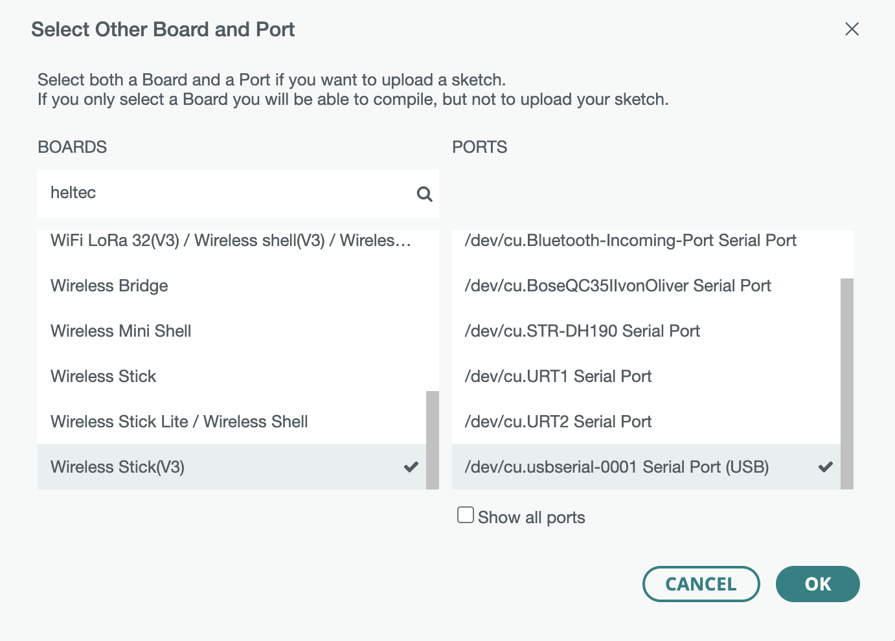

# IoT Platform

## Docker

First install DockerDesktop and `docker-compose`:

- https://www.docker.com/products/docker-desktop/
- https://docs.docker.com/compose/install/

Then you can export a path to mount as a volume and spin up the containers:

```sh
export DATA_DIR = /some/path/to/mount
docker-compose --file software/container/docker-compose.yml up
```

### Mosquitto

```sh
mosquitto_sub -h localhost -t '#' -p 1883
mosquitto_pub -h localhost -p 1883 -t '/' -m $(date --utc +%s)
```

### Grafana

You can login to Grafana: http://localhost:3000/login (admin:admin)

### NodeRed

NodeRed is running here: http://localhost:1880/

## Hardware

### Arduino IDE

We are using HelTec Automation Wirelsess Sticks ESP32 Dev-Boards. Their GitHub repo can be found here: https://github.com/HelTecAutomation/Heltec_ESP32

I had to install VCP Drivers, first: https://www.silabs.com/developers/usb-to-uart-bridge-vcp-drivers?tab=downloads

You can add their Board Manager to the boards managers URLs: https://github.com/HelTecAutomation/Heltec_ESP32/blob/master/library.json and find their libraries in the IDE (Sketch -> Include Library -> Manage Libraries... Search for "heltec esp32").

These boards are already *V3* boards, so be careful selecting the right board and port (VCP).




### Install esptool

Esptool is a Pyhton program to flash ESP32. As it's a Pyhton tool you can install it using `pip`:

```sh
pip install esptool
```

### Find the port 

Usually you can find the used port using `esptool.py`:

```sh
esptool.py write_flash_status --non-volatile 0
```

#### Using MicroPython

Download the firmware:

Flash it using `esptool`: https://micropython.org/download/GENERIC_S3/


```sh
esptool.py --chip esp32s3  write_flash -z 0  ~/Desktop/GENERIC_S3-20220117-v1.18.bin
```

