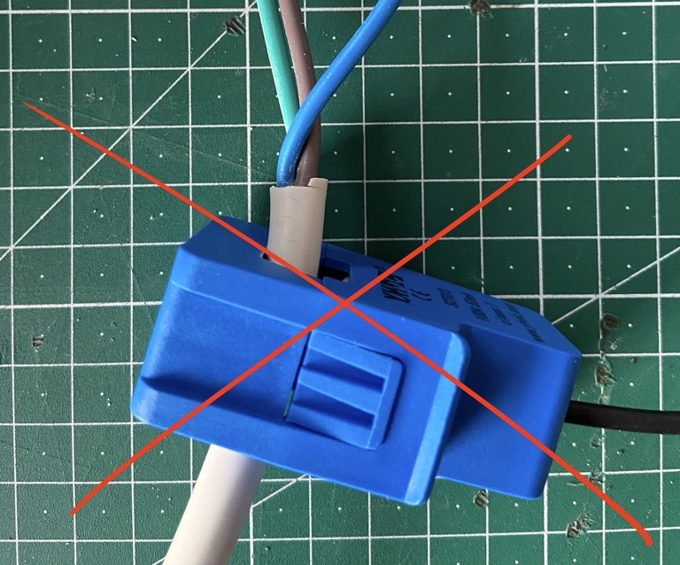
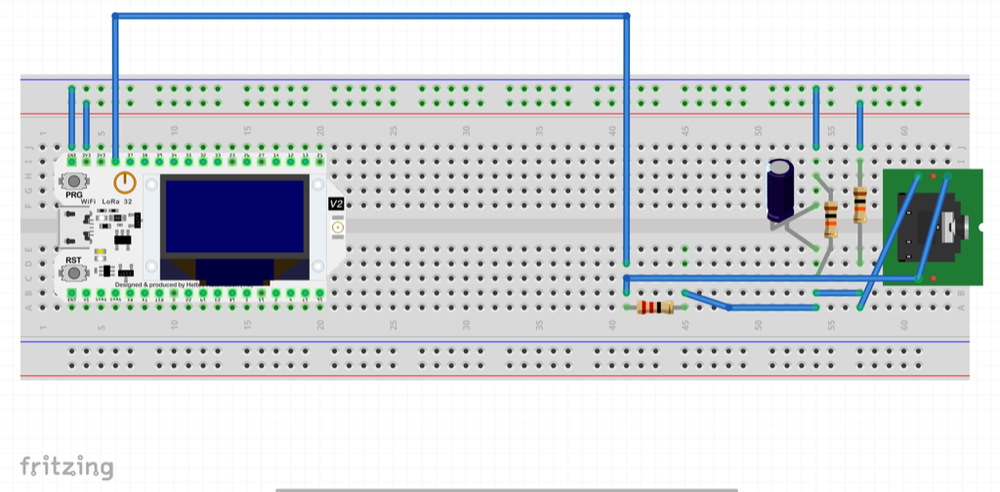

# Energy Monitor

Our energy monitor is based on the [openenergymonitor.org](https://openenergymonitor.org/) project (Licence GNU GPL V3).

It uses our HelTec Wireless Stick. This - of course - can be replaced by a cheaper ESP32 module.

Power Measurement is done by a SCT013 clamp (100A:50mA).

## Build the hardware

### Used materials

- [Bill of Material](../../hardware/BOM.md)

### PinOut

We are using HelTec Automation Wirelsess Sticks ESP32 Dev-Boards.

The PinOut of our version 3 modules can be found here: https://docs.heltec.org/en/node/esp32/dev-board/hardware_update_log.html#wifi-lora-32-hardware-update-logs


We use A1, A2 and A3 because they are free (most ADCs are already used on the HelTec Board)

### Sensors

The SCT-013 sensors are small current transformers (SCT). They have a ferromagnetic core that can be opened and in which we can enclose our conductor. This conductor is the primary winding and the secondary winding is fixed in the sensor and can have 2000 turns. This gives us a ratio of 1:2000 as an example.

When AC current flows through the conductor, a magnetic flux is generated in the ferromagnetic core, which in turn generates an electric current in the secondary winding.

I could not meassure "small" power consumptions (like a LED lamp or a light stripe, as the magnetix flux in the ferromagnet core seems to be too small).


I was able to measure high loads (like a heater the can be switched between 1 kW and 2 kW).


Make sure the clamp is _always positioned towards the consumer_, otherwise it does _not_ work. There is a small arrow on the case.


> Attention: I could not measure any meaningful values on the "cable". I had to go to the wire.



### Breadboard

Let's start with a simple breadboard layout.




To understand this, have a look at this plan:


R1 & R2 are a voltage divider that provides the 1.65 V source. We use 10 kΩ for mains powered monitors. If we want to run on batteries, we have to choose differnt ones (like 470 kΩ resistors to keep the power consumption to a minimum).

Capacitor C1 has a low reactance - a few hundred ohms - and provides a path for the alternating current to bypass the resistor. A value of 10 μF is suitable.

R3 is the burden resistor. Ideal burden would be 19 Ω. As this is not a common value, you could choose 18 Ω or 22 Ω (I am still using a 47 Ω restistor, that has to be replaced).

See the Fritzing file for [details](./energy-monitor.fzz).

## USB-C

Our HelTec Automation Wirelsess Sticks ESP32 Dev-Boards already have USB-C. But they do not support Power Deliver (PD). If your computer tries to do PD, just plug a cheap USB hub between the board and your computer.

## Code

### Arduino IDE

HelTecs GitHub repo can be found here: https://github.com/HelTecAutomation/Heltec_ESP32

I had to install VCP Drivers, first: https://www.silabs.com/developers/usb-to-uart-bridge-vcp-drivers?tab=downloads

You can add their Board Manager to the boards managers URLs: https://github.com/HelTecAutomation/Heltec_ESP32/blob/master/library.json and find their libraries in the IDE (Sketch -> Include Library -> Manage Libraries... Search for "heltec esp32").

> These boards are already _V3_ boards, so be careful selecting the right board and port (VCP).


### Print to serial out

Start with a simple code that just prints the values. The code is quite simple, as we can use the existing _[EmonLib libary V1.1.0 by OpenEnergyMonitor](https://docs.openenergymonitor.org/electricity-monitoring/ct-sensors/)_.

[Check out the small amount of code to print the values to serial out.](../../software/energy-monitor/01-energy-monitor-serial-out/) This piece of code is based on on Thomas Edlinger's code for [Edi's Tech Lab](https://www.edistechlab.com).

The only interesting part is this line:

```C
  emon1.current(current1Pin, 8);  // Pin and Calibration
```

The [calibration](https://docs.openenergymonitor.org/electricity-monitoring/ctac/calibration.html) value "8" was done with a Fluke multimeter (and maybe a not so ideal burden resistor).

The code just prints the current power consumption to serial out:

```txt
16:28:18.915 -> 2853.16 Watt  -  12.41 Ampere
16:28:19.998 -> 2854.63 Watt  -  12.41 Ampere
16:28:21.119 -> 2850.93 Watt  -  12.40 Ampere
16:28:22.207 -> 1702.19 Watt  -  7.40 Ampere
16:28:23.289 -> 400.62 Watt  -  1.74 Ampere
16:28:24.367 -> 94.42 Watt  -  0.41 Ampere
```

### Post to MQTT

#### Boot up MQTT

Now follow this documentation to set up [IoT Prototyping Backend](https://code.curious.bio/curious.bio/iot-backend).

#### Credentials

To connect to your Wifi and access your MQTT server you have to add this to an `environment` [header file](../../software/energy-monitor/02-energy-monitor-mqtt/environment.h):

```C
// Replace with your network credentials
#define secrect_ssid "Guest"
#define secret_password "guestguest"
#define mqtt_server "192.168.2.103"
#define mqtt_port 1883
#define mqtt_prefix "/iot-platform/energy-monitor/test-device"
```

The `mqtt_server` in tis example posts to my local IP adress. The Wifi network is a `Guest` network I just created for this test.

The `mqtt_prefix` should be different per device, as this is the topic prefix used to identify the device.

We now can consume this messages in Node-RED, store them in InfluxDB and build a dashboard in Grafana.

If you haven't deployed the [IoT prototyping backend yet, check out our guide](https://code.curious.bio/curious.bio/iot-backend/).

### Testing

You can subscribe to your local MQTT server and subscribe to all or just the interesting topics:

```sh
mosquitto_sub -h localhost -t '#' -p 1883 #all
mosquitto_sub -h localhost -t '/iot-platform/energy-monitor/test-device/ampere' -p 1883 #current
mosquitto_sub -h localhost -t '/iot-platform/energy-monitor/test-device/watt' -p 1883 #power
```

### Interesting code blocks

Posting to MQTT is quite simple. After setting up Wifi and connection to the MQTT server, it's just a few lines of code:

```C
  client.publish(concat(mqttPrefix, "/watt"), powerArray);
  client.publish(concat(mqttPrefix, "/ampere"), irmsArray);
```

Have a look at the complete [example](../../software/energy-monitor/02-energy-monitor-mqtt/).

## Simulator

If you just need random inputs (without using the actual hardware), you can simply modify my short [shell script](../../software/energy-monitor/00-simulator/).

## Links

- A very comprehensive project to build an energy monitor can be found in the [ESP32 + ESPHome Open Source Energy Monitor project by Daniel BP](https://github.com/danpeig/ESP32EnergyMonitor).
- A nice (German) [video tutorial can be found at Eddie's Techlab](https://edistechlab.com/sct013-sensor-zum-wechselstrom-messen/).
- Have a look at the [complete documentation of the Open Energy Monitor project](https://docs.openenergymonitor.org/).
- There is also a German [example project](http://www.technik-fan.de/index.php/Open_Energy_Monitor_mit_dem_ESP32) (that currently cannot be reached over TLS, so be careful before clicking this link).
- MQTT and ESP32 is described in this article ["How to Connect ESP32 to MQTT Broker"](https://iotdesignpro.com/projects/how-to-connect-esp32-mqtt-broker).
