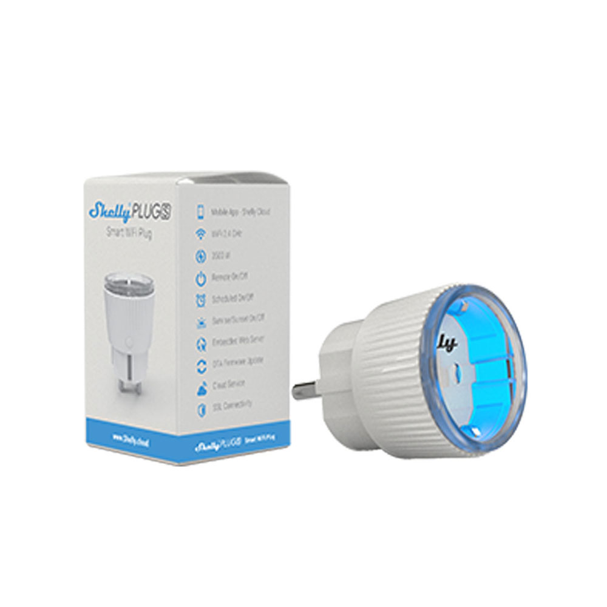
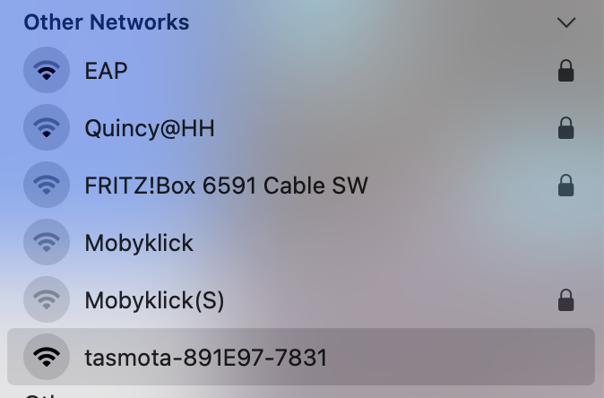
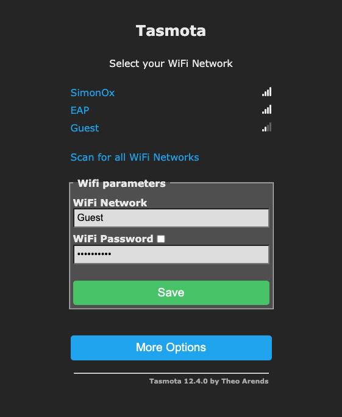
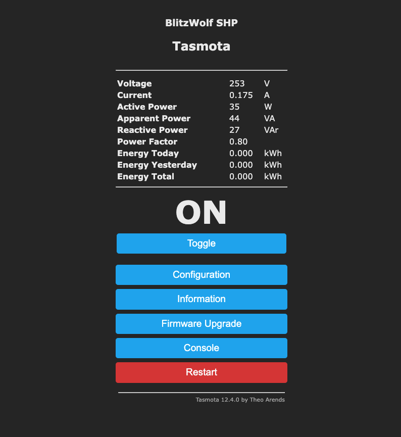
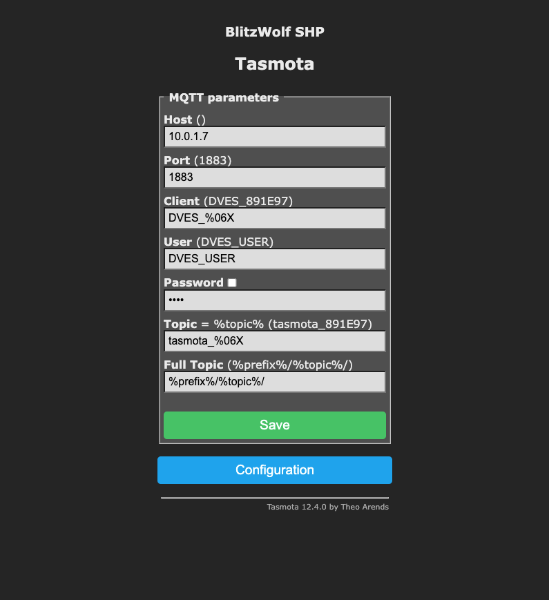
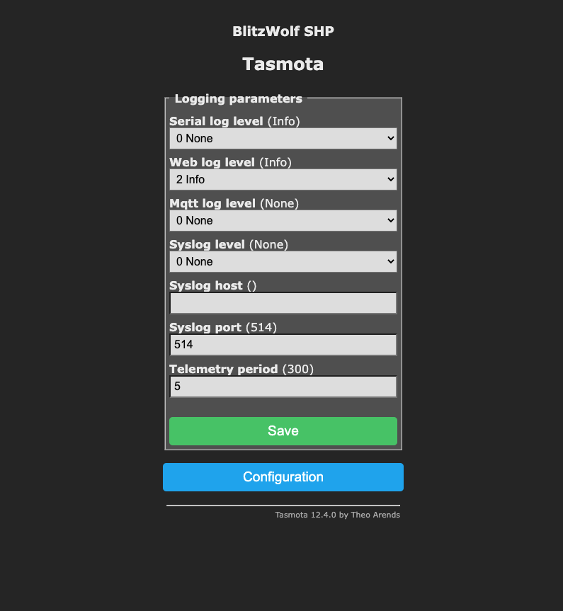

# Shelly Plug (S)

Shelly Plugs S are quite cheap but relatively accurate to measure power consumptions less than 2.5 kW.



## Flash Tasmota

There's an OpenSource project to flash Tasmota on Shelly Plugs: [mg2x](https://github.com/arendst/mgos-to-tasmota).

Locate your Shellie's IP adress (in my case: 192.168.2.150) and update it "over the air" with the Tasmota firmware:

http://192.168.2.150/ota?url=http://ota.tasmota.com/tasmota/shelly/mg2tasmota-ShellyPlugS.zip

Your Shelly will return a JSON object that looks like that:

```
{
  "status": "updating",
  "has_update": false,
  "new_version": "20230109-114426/v1.12.2-g32055ee",
  "old_version": "20230109-114426/v1.12.2-g32055ee"
}
```

After a while your Shelly Plug S should be flashed with Tasmota firmware.

> Just be patient. This took longer than five minutes in my DSL connected network.

The Shelly Plus S will create create a new Wifi.



Join that Wifi and configure the device: http://192.164.4.1/



You can configure it as a BlitzWolf SHP product.

Then it offers you power measurement and a programmable toogle.



It should be configurable just like our [plant monitor](../plant-monitor/README.md).

Just enable MQTT and enter a shorter telemetry period.

 

It will post MQTT messages unter a topic `tele/tasmota_891E97/SENSOR` like this one:

```
{
  "Time": "2023-02-27T16:45:07",
  "ENERGY": {
    "TotalStartTime": "2023-02-27T16:33:06",
    "Total": 0.004,
    "Yesterday": 0,
    "Today": 0.004,
    "Period": 0,
    "Power": 34,
    "ApparentPower": 44,
    "ReactivePower": 27,
    "Factor": 0.79,
    "Voltage": 253,
    "Current": 0.172
  }
}
```

We now can consume this messages in Node-RED, store them in InfluxDB and build a dashboard in Grafana.

If you haven't deployed the [IoT prototyping backend yet, check out our guide](https://code.curious.bio/curious.bio/iot-backend/).

## Links

- [Pinout for the ESP8266 based Shelly Plug-S Smart Plug
  ](https://faulty.cloud/blog/shelly-plug-s-pinout)
- [Youtube video: Upgrade Shelly Switches | Easy NO Soldering Smart Garage Door Opener](https://www.youtube.com/watch?v=_oRr8FZyyQ0)
- [mg2x](https://github.com/arendst/mgos-to-tasmota)
- [Shelly Plug S Power Monitoring Plug Tasmota template](https://templates.blakadder.com/shelly_plug_S.html)
