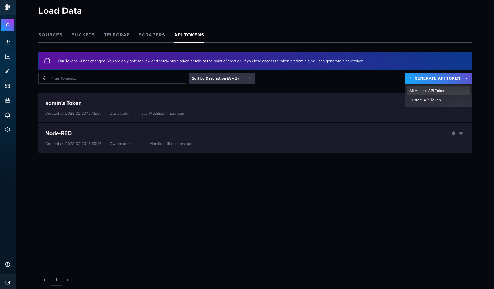
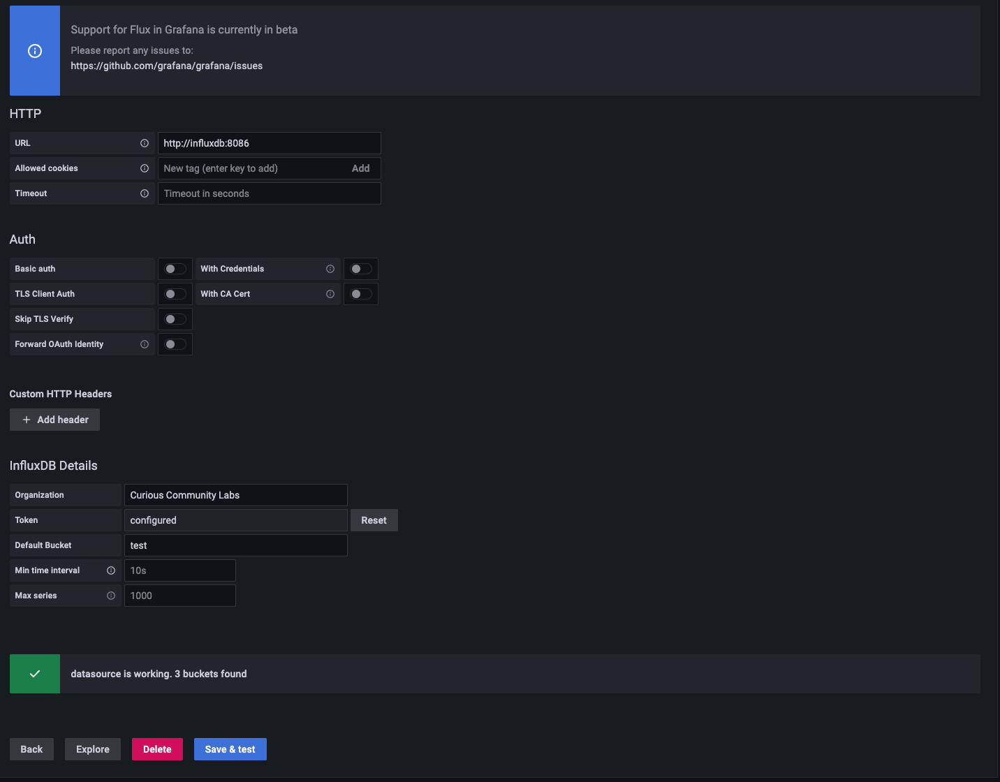
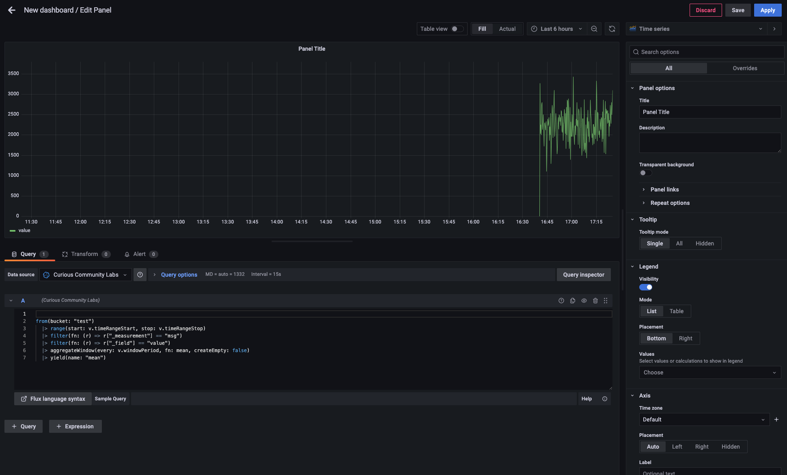

# Grafana

Grafana is an open source analytics and interactive visualization tool. It provides charts, graphs, and alerts for the web when connected to supported data sources. 

As a visualization tool, Grafana is a popular component in monitoring stacks, often used in combination with time series databases such as InfluxDB.

## Connection

To connect Grafana to our Influx-DB, you have to create a data source.

The `URL`of our InfluxDB is `http://influxdb:8086`. In InfluxDB you have to create a `token` to connect: [Load Data -> API Tokens](http://localhost:8086/orgs/721027680173bf2f/load-data/tokens).



You can use this token to create a connection from Grafana to Influx-DB.


After having a connection to a database you can easily create an own dashboard in Grafana.

Here's the demo snippet (directly copyied from Influx Data Explorer) and the screen shot

```
from(bucket: "test")
  |> range(start: v.timeRangeStart, stop: v.timeRangeStop)
  |> filter(fn: (r) => r["_measurement"] == "msg")
  |> filter(fn: (r) => r["_field"] == "value")
  |> aggregateWindow(every: v.windowPeriod, fn: mean, createEmpty: false)
  |> yield(name: "mean")
```




