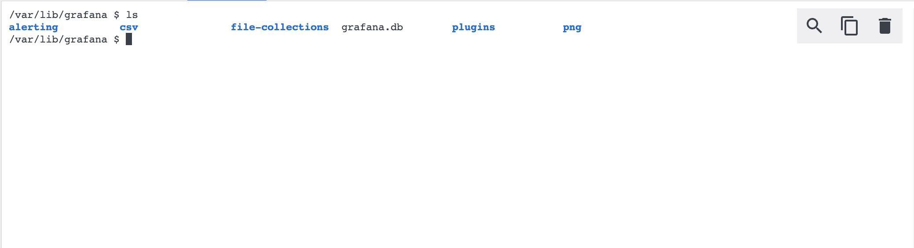
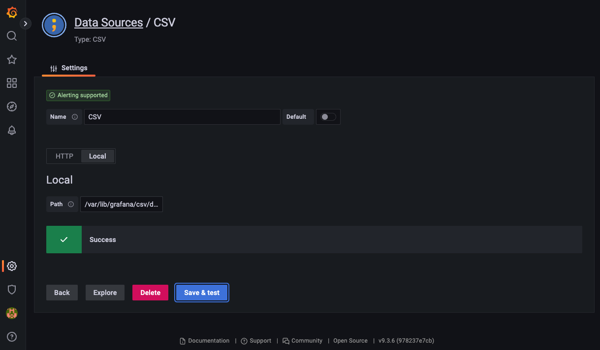
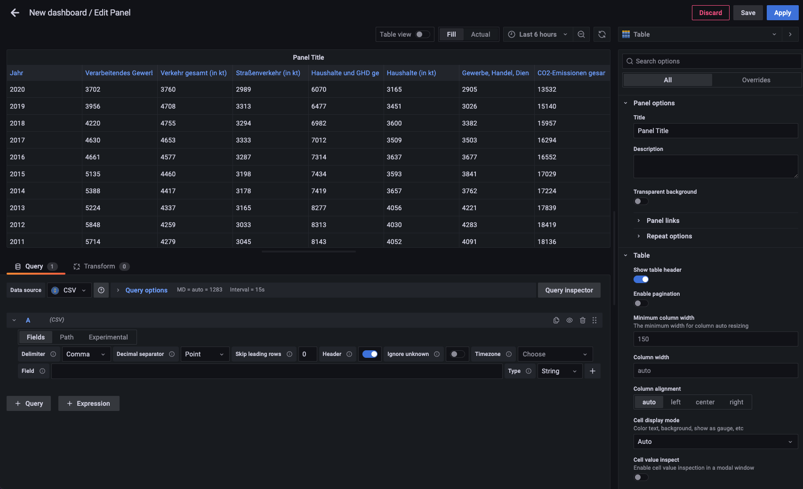
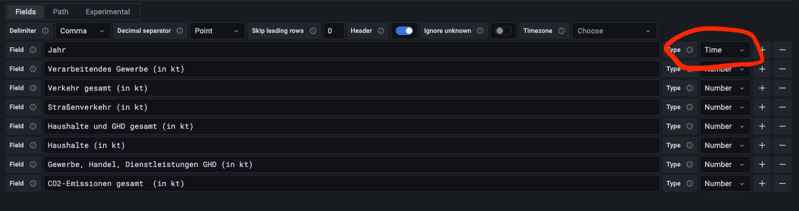
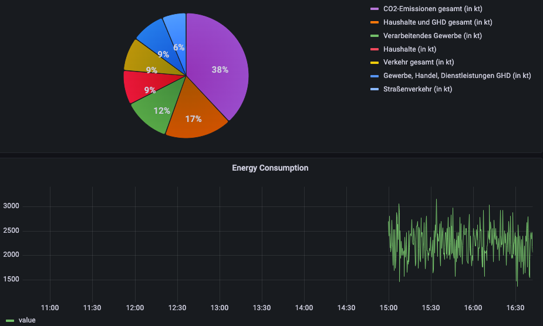

# CSV Import

## Grafana

In Grafana there is a [csv-datasource plugin](https://grafana.github.io/grafana-csv-datasource/). This plug lets you visualize data from any URL that returns CSV data, such as REST APIs or static file servers. You can even load data from a local file path. But it is *not* importing CSV from Grafana into a data source (like InfluxDB) or uploading CSV data to a local file system.

> For visualizing CSV data this is enough. Why should you duplicate data if the true data source is a CSV file located somewhere in the internet. If the CSV is not online, this might be another story.

I added this plugin to our Grafana installation, so it's ready to be used.

> I just mounted the whole [Grafana directory](../grafana/) into our Docker-Compose setup. Maybe we have to come up with a better solution.

Garafana is running on [localhost on port 3000 with credentials admin:admin](http://localhost:3000). So let's get there to add the CSV file as a usable data source.

> I added the CSV file to this repository and mounted it into our Docker-Compose setup. So the CSV file is also available in Grafana. Maybe we have to come up with a better solution..  

As the CSV is reachable by Grafana, you can create a data source, there.

> grafana.ini is also mounted from [this repository](../grafana.ini). So local data mode is enabled.

Whith Grafana having access to data in the CSV file, it's easy to access this data to create a dashboard.

