# Plant Monitor

## 

We use our existing plant monitor for this project.


## Tasmota

[Tasmota](https://tasmota.github.io/docs/) is an alternative Firmware for ESP8266. It's easy to use with it's graphical user interface.

You can flash Tasmota right from the browser using the [Tasmota Web Installer](https://tasmota.github.io/).

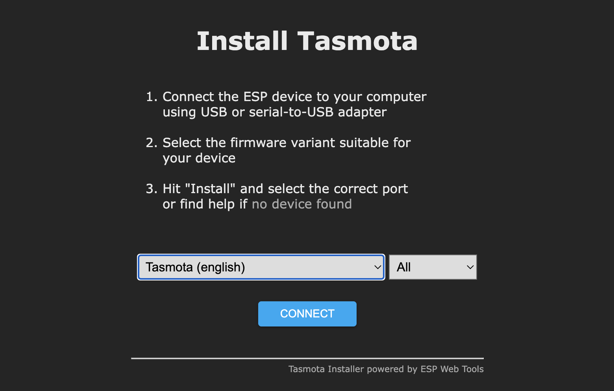

You have to connect your device through USB and select the right port. Exisisting firmware will be delete.

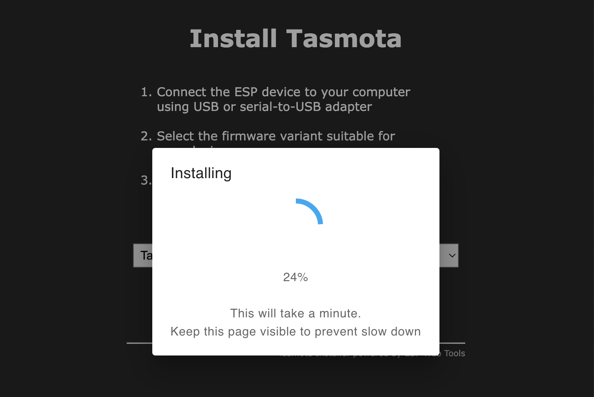

After Tasmota has been flashed to your ESP, you can already set up your wifi.

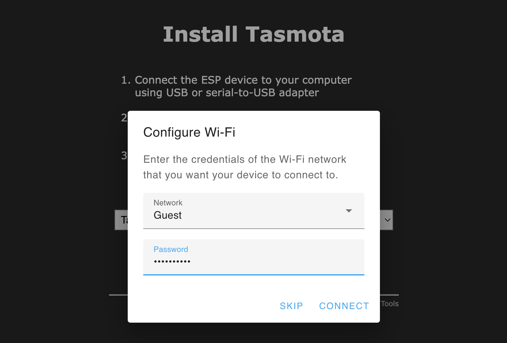

After your device is connected to Wifi, you can switch over to the web UI of your device. Yes, your device now runs an embedded web server. There you can configure your device.

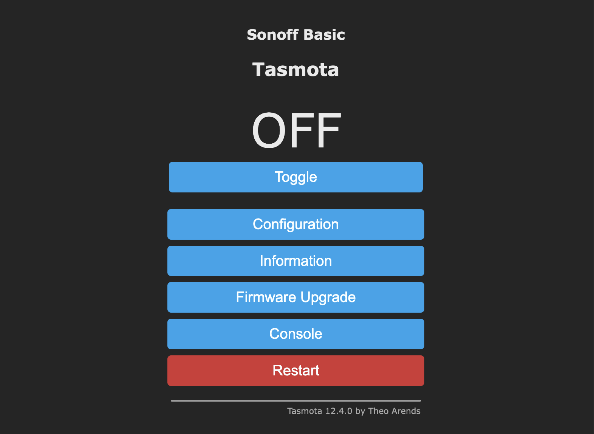

### Configure

Using this Web UI you can setup up your device: `Configure -> Configure Module`

Our Wemos D1 mini clone is a `generic device with 18 ports`. We have a DHT11 connected to D1 and an analogue measurement on A0.

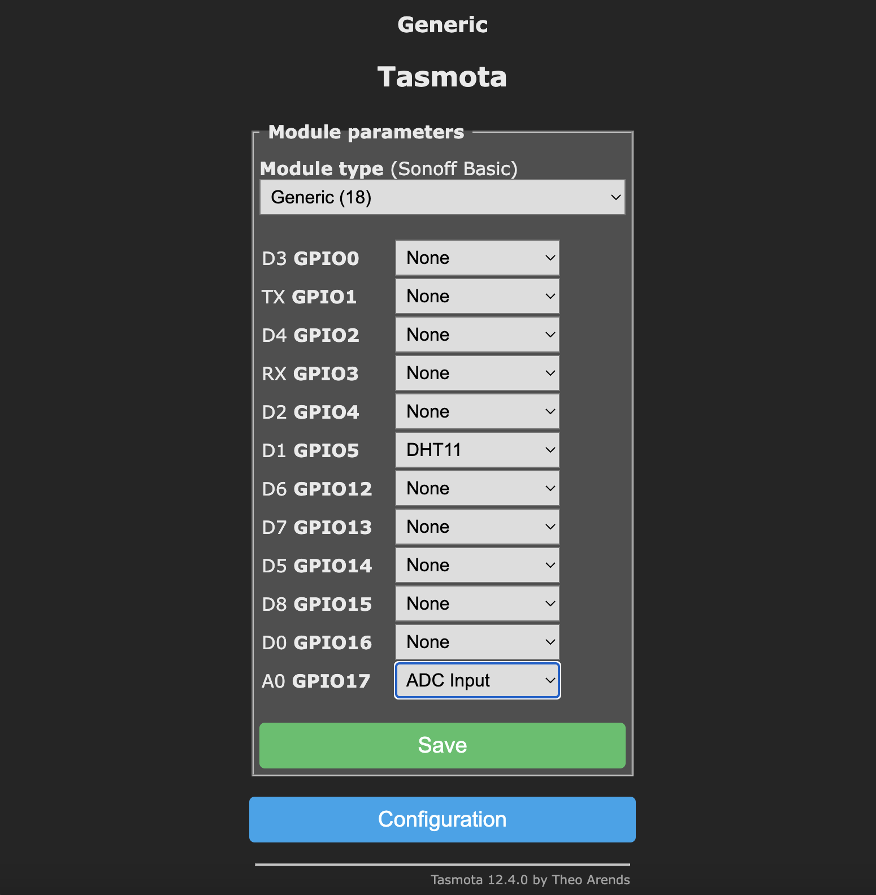


After configuring it this way, we can see you data in the web UI.

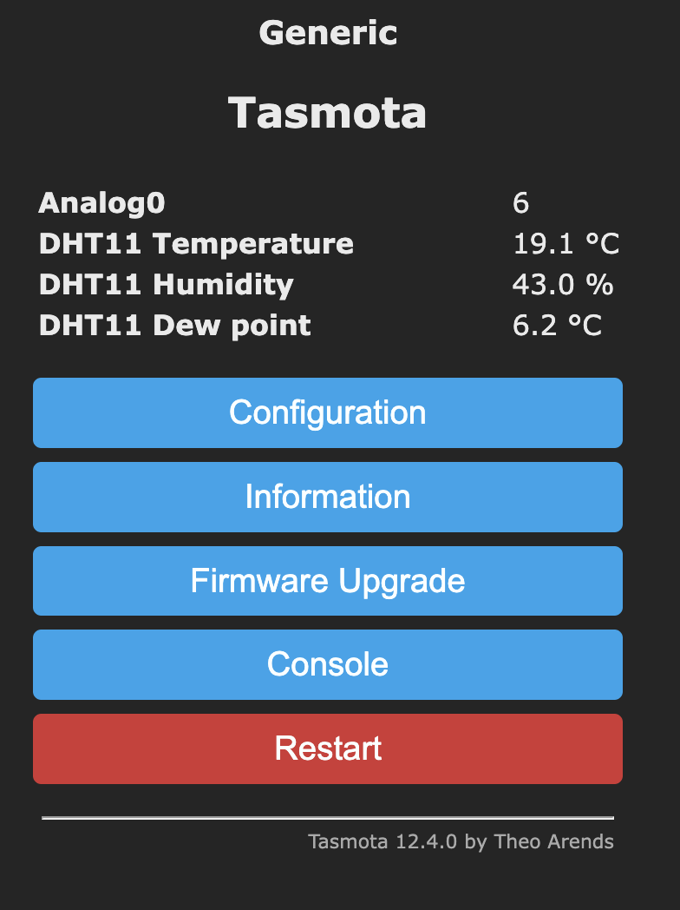

### MQTT

Tasmota's main protocol is MQTT. You can setup MQTT under `Configuration -> MQTT`.

 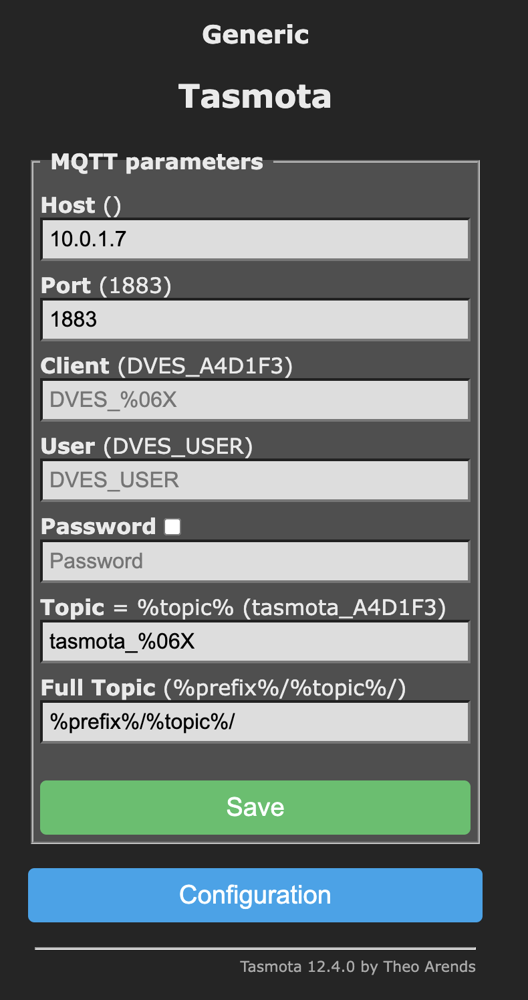

To send data more frequent (nice for debugging) you have to change the telemetry period to a lower leven (than 300 s / 5 min).

 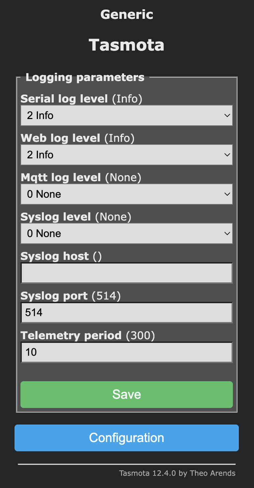
 
 Then our device will send data like this:
 
 ```
 {
  "Time": "2023-02-26T17:19:55",
  "ANALOG": {
    "A0": 6
  },
  "DHT11": {
    "Temperature": 19,
    "Humidity": 44,
    "DewPoint": 6.4
  },
  "TempUnit": "C"
}

 ```
You can subscribe to this MQTT event in Node-RED.

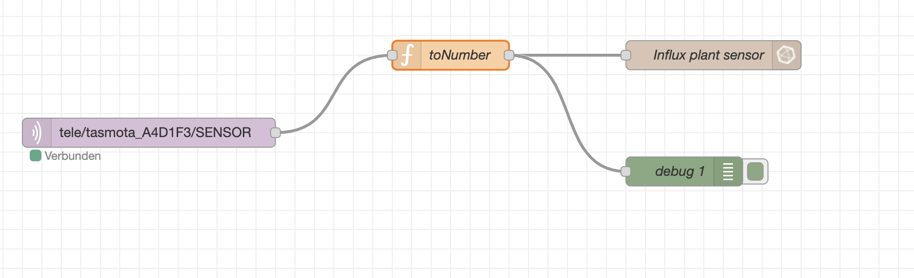

There is a small converter function, so we only store the interesting values in InfluxDB.

```
return {
    payload: {
        temperature: Number(msg.payload.DHT11.Temperature),
        humidity: Number(msg.payload.DHT11.Humidity)
    }
};
```
We can query this data in InfluxDB.

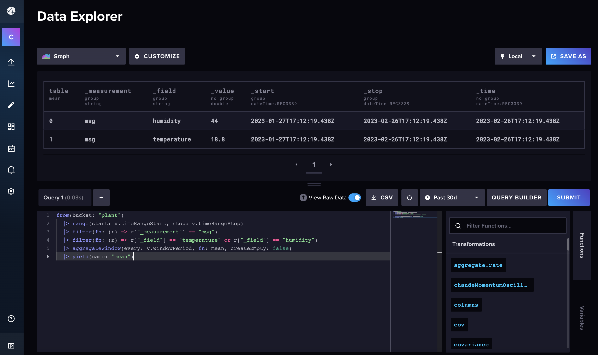

This is our query.

```
from(bucket: "plant")
  |> range(start: v.timeRangeStart, stop: v.timeRangeStop)
  |> filter(fn: (r) => r["_measurement"] == "msg")
  |> filter(fn: (r) => r["_field"] == "temperature" or r["_field"] == "humidity")
  |> aggregateWindow(every: v.windowPeriod, fn: mean, createEmpty: false)
  |> yield(name: "mean")
```

We can use this query to create a dashboard in Grafana.
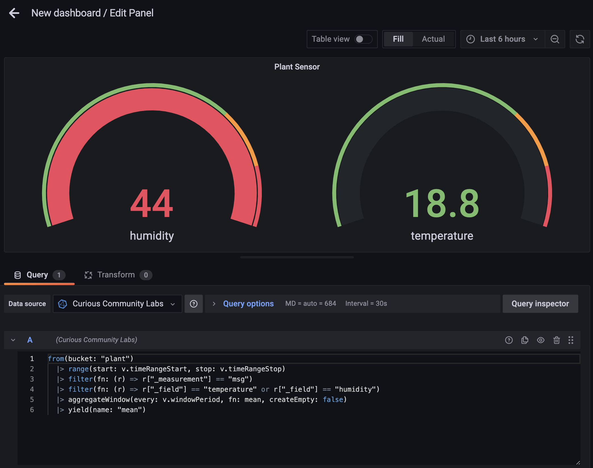

