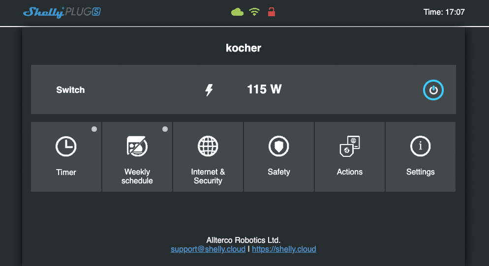
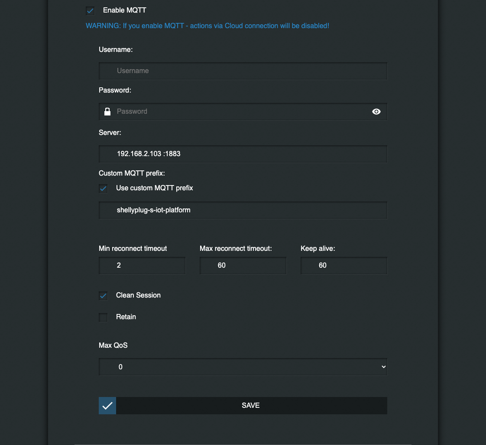

# Shelly Plug

If you already have a sheyll device, you can locate it in your network.



MQTT can be enabled under "ADVANCED - DEVELOPER SETTINGS" -> "MQTT".



Then it will post a message on boot to your MQTT server:
```json
{
  "wifi_sta": {
    "connected": true,
    "ssid": "Guest",
    "ip": "192.168.2.150",
    "rssi": -43
  },
  "cloud": {
    "enabled": false,
    "connected": false
  },
  "mqtt": {
    "connected": true
  },
  "time": "17:19",
  "unixtime": 1676909964,
  "serial": 1,
  "has_update": false,
  "mac": "4022D8891E97",
  "cfg_changed_cnt": 0,
  "actions_stats": {
    "skipped": 0
  },
  "relays": [
    {
      "ison": true,
      "has_timer": false,
      "timer_started": 0,
      "timer_duration": 0,
      "timer_remaining": 0,
      "overpower": false,
      "source": "input"
    }
  ],
  "meters": [
    {
      "power": 117.46,
      "overpower": 0,
      "is_valid": true,
      "timestamp": 1676913564,
      "counters": [
        0,
        0,
        0
      ],
      "total": 0
    }
  ],
  "temperature": 0,
  "overtemperature": false,
  "tmp": {
    "tC": 0,
    "tF": 32,
    "is_valid": true
  },
  "update": {
    "status": "unknown",
    "has_update": false,
    "new_version": "",
    "old_version": "20230109-114426/v1.12.2-g32055ee"
  },
  "ram_total": 52064,
  "ram_free": 39744,
  "fs_size": 233681,
  "fs_free": 166664,
  "uptime": 5
}
```

You an use shelly script to update this status periodically.

