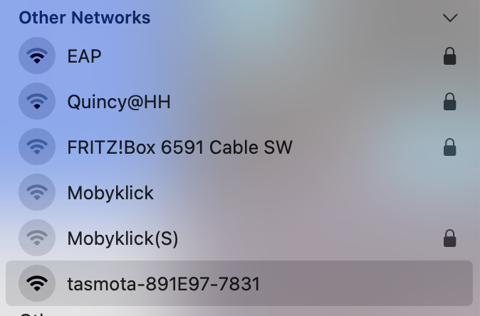
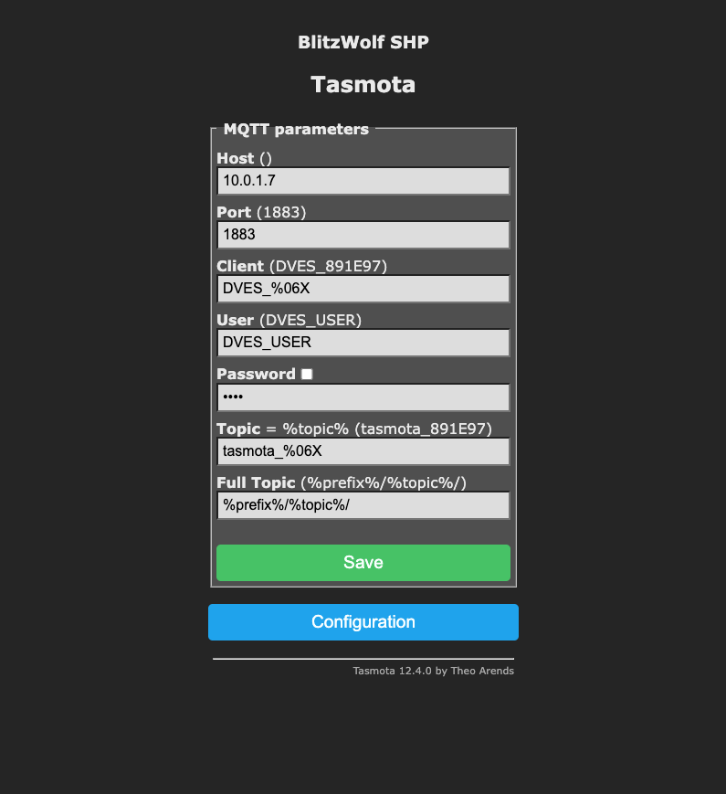
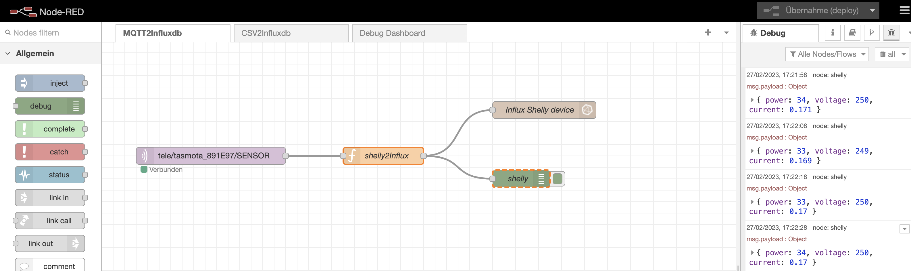
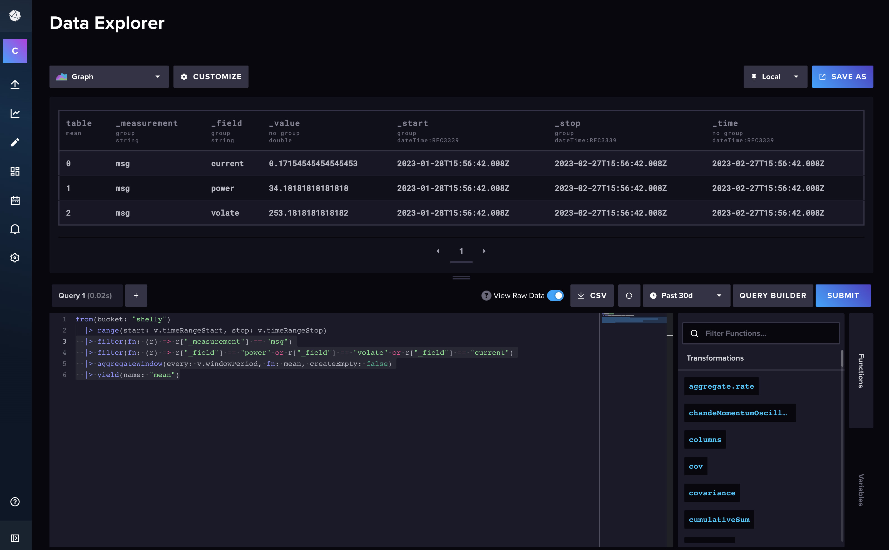
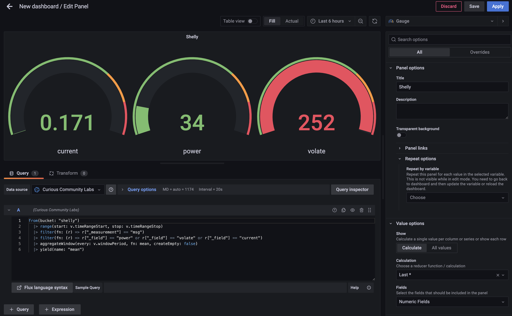

# Shelly Plug

Shelly Plugs are quite cheap but relatively accurate to measure power consumptions less than 2.5 kW.

## Flash Tasmota

There's an OpenSource project to flash Tasmota on Shelly Plugs:  [mg2x](https://github.com/arendst/mgos-to-tasmota)

Locate your Shellie's IP adress (in my case: 192.168.2.150) and update it "over the air" with the Tasmota firmware:

http://192.168.2.150/ota?url=http://ota.tasmota.com/tasmota/shelly/mg2tasmota-ShellyPlugS.zip

Your shelly will return a JSON object that looks like that:

```
{
  "status": "updating",
  "has_update": false,
  "new_version": "20230109-114426/v1.12.2-g32055ee",
  "old_version": "20230109-114426/v1.12.2-g32055ee"
}
```

After a while your Shelly Plug S should be flashed with Tasmota firmware.

> Just be patient. This took longer than five minutes in my DSL connected network. 

The Shelly Plus S will create create a new Wifi. 



Join that Wifi and configure the device: http://192.164.4.1/


You can configure it as a BlitzWolf SHP product. 

Then it offers you power measurement and a programmable toogle.


It should be configurable just like our [plant monitor](../plant-monitor/README.md).

Just enable MQTT and enter a shorter telemetry period.

 

It will post MQTT messages unter a topic `tele/tasmota_891E97/SENSOR` like this one:

```
{
  "Time": "2023-02-27T16:45:07",
  "ENERGY": {
    "TotalStartTime": "2023-02-27T16:33:06",
    "Total": 0.004,
    "Yesterday": 0,
    "Today": 0.004,
    "Period": 0,
    "Power": 34,
    "ApparentPower": 44,
    "ReactivePower": 27,
    "Factor": 0.79,
    "Voltage": 253,
    "Current": 0.172
  }
}
```

We now can consume this messages in Node-RED, store them in InfluxDB and build a dashboard in Grafana.

### InfluxDB Bucket

I created a bucket called `Shelly`in InfluxDB, so we can store the messages in this bucket.

### Node-RED

I create a usual flow in Node-RED. A MQTT node fetches the values. 



The message is fed into a filter function to only store usefull information:

```
return  {
    payload: {
        power: Number(msg.payload.ENERGY.Power),
        volate: Number(msg.payload.ENERGY.Voltage),
        current: Number(msg.payload.ENERGY.Current)
    }
};
````

The `payload` will be stored in InfluxDB in the bucket "shelly".

### InfluxDB Data Explorer

In Influx DB Data Explorer you can query the stored data.



The query created by Data Explorer looks like that:

```
from(bucket: "shelly")
  |> range(start: v.timeRangeStart, stop: v.timeRangeStop)
  |> filter(fn: (r) => r["_measurement"] == "msg")
  |> filter(fn: (r) => r["_field"] == "power" or r["_field"] == "volate" or r["_field"] == "current")
  |> aggregateWindow(every: v.windowPeriod, fn: mean, createEmpty: false)
  |> yield(name: "mean")
```

### Grafana

Using this query you can crate a dashboard in Grafana.

