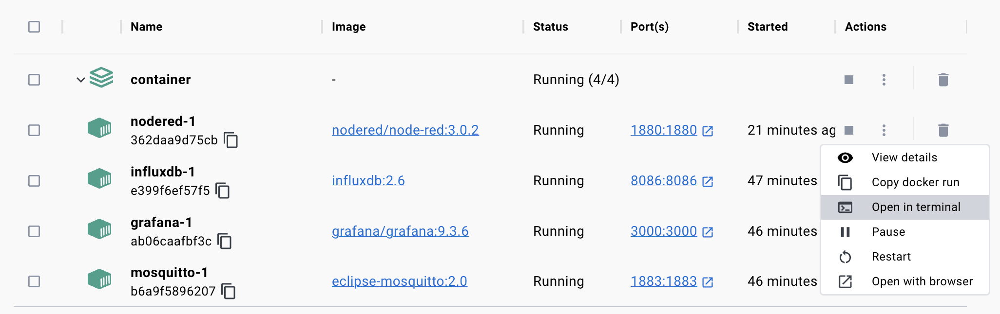

# Node-RED

If you boot up our tech stack using `docker-compose` you already have a Node-RED instance running on [your local machine](http://localhost:1880/).

## First steps

For debuging I am going to install Node-RED's own dashboard.

Shell into your Docker container.



Inside the container you can install the Node-RED Dashboard (we will switch to Grafana, soon):

```sh
npm install node-red-dashboard
```

The dashboard should be visible on the righmost menu item in Node-RED.


In Node-RED you can add a MQQT node to receive values from the power monitor, hook it up to a gauge and display it on a dasboard.


  

In the dasboard section you have to create a tab. Inside this tab you have to create a group. 


The tricky part is putting the gauges in the group. This is also done in the gauge's settings.
 

You can view the dashboard in an (also mobile) web browser.


Have a look at the flow also in [this repository](./00-dashboard-example/dashboard.json).